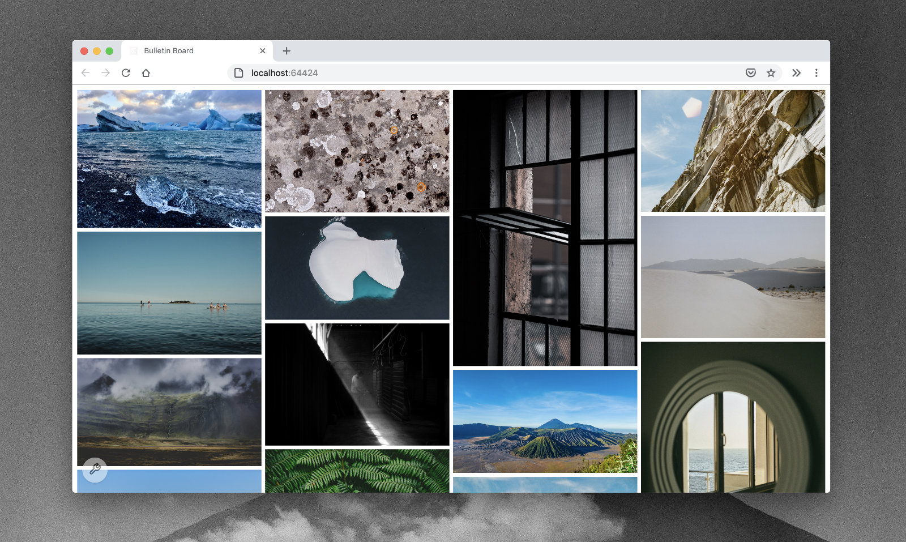

`bulletinboard` is a CLI tool that runs a server for viewing locally-hosted images.

View more screenshots [here](./docs/screens). Examples images from <a href="https://unsplash.com/">Unsplash</a>.

## Usage

- Download the latest release from the [releases]() page. 
- Move the `bulletinboard` binary into your path if you want to run it from any directory.
- Run `bulletinboard` in a folder with images in it, or alternatively;
  - Run `bulletinboard -path <path_to_folder_of_images>`
- Visit the given localhost url and view your images.

## Development

- Requirements: `>= go 1.14`.
- Clone the repository.
- Run `make run`.